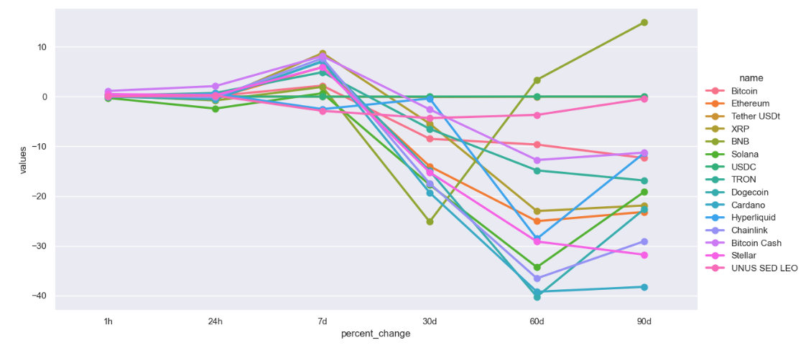
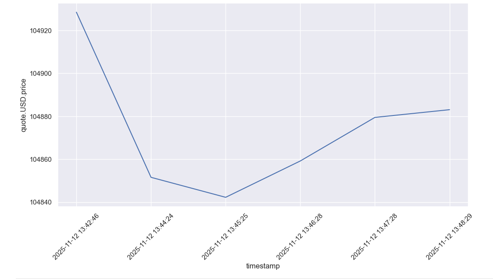

# Cryptocurrency Data Collector & Visualizer

This project fetches real-time cryptocurrency data from the CoinMarketCap API, processes it with pandas, and visualizes price trends with Seaborn. It tracks multiple cryptocurrencies, computes percentage changes, and allows easy analysis of historical and real-time data.

## Features
- Fetches the latest cryptocurrencies (top 15).
- Converts API responses into a pandas DataFrame and adds a timestamp.
- Saves or appends the data into a CSV file.
- Supports automated data collection at regular intervals.
- Visualizes data: shows percentage changes over time for multiple cryptocurrencies and allows focused analysis on Bitcoin with line and point plots.

## Example Visualizations

**Figure 1:** Percentage Change Over Time for Top Cryptocurrencies

**Figure 2:** Bitcoin Price Trend Over Time  

